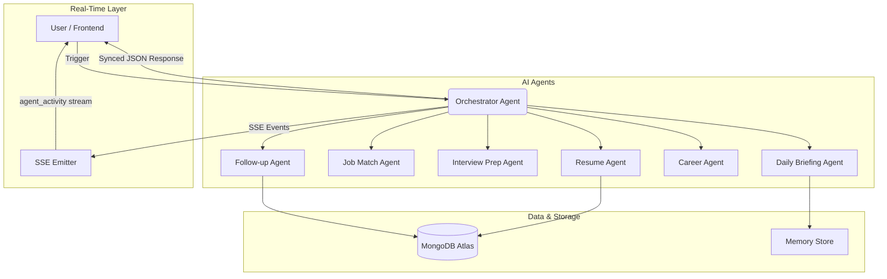
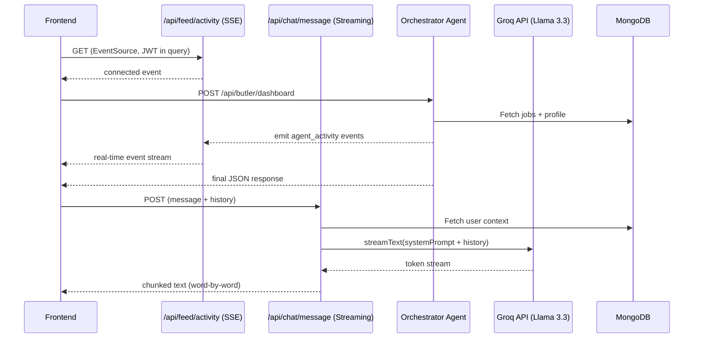
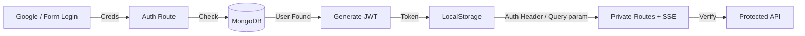
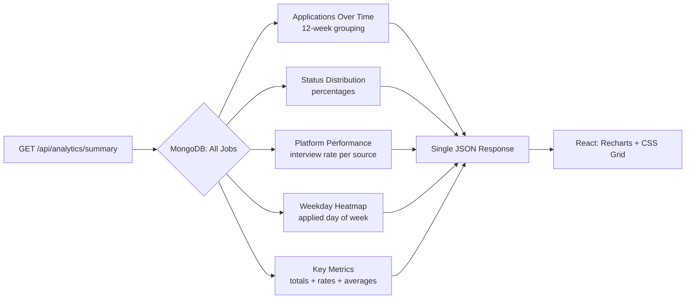
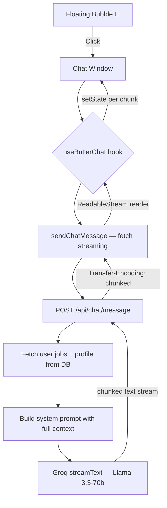
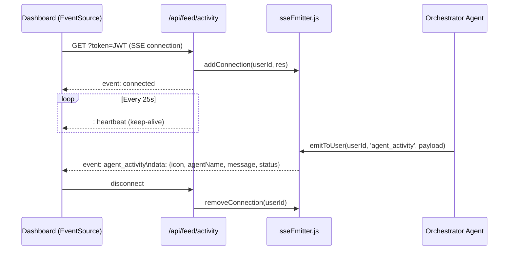

# Apply-Flow: AI-Powered Career Assistant 🚀

Apply-Flow is a premium, full-stack job search and discovery platform that transforms the job hunt into a personalized, AI-guided journey. Using a **Multi-Agent Orchestration** system, it not only aggregates jobs but acts as your personal **Career Butler** — tracking every application, streaming live activity, answering questions in real time, and visualising your progress.

---

## 🏗️ System Architecture

### 1. Multi-Agent AI Orchestration
The heart of Apply-Flow is its **Orchestration Layer**. Specialised agents handle different domains of the career search and broadcast their progress live to the user via Server-Sent Events.



### 2. Real-Time Architecture — Agent Feed + Butler Chat
Two parallel real-time pipelines run simultaneously: an **SSE push channel** for live agent logs and a **streaming HTTP endpoint** for the chat interface.



### 3. Job Recommendation Flow
The Discover engine aggregates and scores jobs in real time across multiple APIs.


### 4. Authentication & Security Flow



### 5. Analytics Data Pipeline
All 5 datasets computed server-side in a single request — nothing heavy runs in the browser.



---

## 📱 Pages & Features

### 1. Butler Dashboard (`/dashboard`)
- **Morning Briefing** — Groq Llama 3.3 synthesises your tasks into an upbeat daily plan.
- **Live Tracker Stats** — Direct sync from MongoDB with zero-cache headers.
- **Action Items** — Follow-up queue from the Follow-up Agent.
- **🆕 Agent Activity Feed** — Real-time SSE panel showing what each AI agent is doing as it runs.

### 2. Job Discovery (`/discover`)
- **Multi-API Aggregation** — JSearch, Adzuna, The Muse fetched concurrently.
- **Matching Score** — NLP keyword match against your profile skills.
- **Session Cache** — Prevents redundant API calls during navigation.

### 3. Application Tracker (`/applications`)
- **CRUD Operations** — Add, Edit, Delete applications.
- **Status Pipeline** — Applied → Interview → Offer → Rejected.
- **Notes & Logs** — Per-application notes with inline editing.

### 4. Career Butler (`/career`)
- **Pattern Recognition** — Analyses rejections to surface skill gaps.
- **Personalised Roadmap** — Step-by-step plan toward your target role.
- **Resume Analysis** — PDF upload scanned against market requirements.

### 5. Job Detail View (`/jobs/:id`)
- **Interview Prep Kit** — Custom prep generated when status changes to Interview.
- **AI Email Drafts** — Follow-up emails using the actual company and role name.

### 6. 🆕 Application Analytics (`/analytics`)
A dedicated read-only data visualisation page built with **Recharts**.

| Chart | Type | Library |
|---|---|---|
| Applications Over Time | LineChart (12 weeks) | Recharts |
| Application Status | Donut (PieChart) | Recharts |
| Platform Performance | Horizontal BarChart | Recharts |
| Most Active Days | Heatmap grid | Custom CSS Grid |
| Insight Card | Logic-based text | Pure JS |

**6 Key Metric Cards**: Total Applications · Active · Interview Rate · Avg Response Days · Offers · This Week

**Smart Insight Engine** — pure frontend logic generates context-aware advice:
- Which platform converts best
- Response time warnings
- Weekly application pace nudges

---

## 🤖 🆕 Butler Chat Interface

A floating AI chat assistant available on every authenticated page.



**Features:**
- 🔄 **Real-time streaming** — words appear word-by-word as Groq responds
- 🎯 **Context-aware** — Butler knows your actual companies, roles, skills, and priorities
- 💡 **Smart suggestions** — chips auto-update with high-priority actions from `/api/butler/today`
- 💬 **History** — last 10 messages sent with every request for conversational memory
- 🗑️ **Clear chat** — one-click reset
- 🔔 **Notification dot** — shows when there are unread messages and chat is closed
- 📱 **Responsive** — adapts to mobile screen widths

---

## 🆕 Real-Time Agent Activity Feed (SSE)

Live agent activity streamed to the Dashboard using **Server-Sent Events**.



---

## ✨ AI Features & Logic

| Feature | Agent | Model |
|---|---|---|
| Daily Briefing | `dailyBriefingAgent` | Groq Llama 3.3-70b |
| Butler Chat | `/api/chat/message` | Groq Llama 3.3-70b (streaming) |
| Interview Prep Kit | `interviewPrepAgent` | Groq Llama 3.3-70b |
| AI Email Draft | `followUpAgent` | Groq Llama 3.3-70b |
| Resume Analysis | `resumeAgent` | Groq Llama 3.3-70b |
| Career Roadmap | `careerAgent` | Groq Llama 3.3-70b |
| Job Matching | `jobMatchAgent` | NLP keyword scoring |

---

## 🛠️ Tech Stack

| Layer | Technology |
|---|---|
| Frontend | React 18 + Vite, CSS Modules, React Router v6 |
| Charts | **Recharts** (LineChart, PieChart, BarChart) |
| Icons | **Lucide React** |
| Backend | Express 5, Node.js |
| AI | **Vercel AI SDK** + **Groq Provider** (Llama 3.3-70b) |
| Database | MongoDB Atlas + Mongoose |
| Auth | JWT + Google OAuth 2.0 |
| Real-Time | **Server-Sent Events (SSE)** + chunked streaming |
| Scheduler | node-cron |
| Styling | Vanilla CSS — Neo-Brutalism design system |

---

## 📦 Installation & Setup

### 1. Clone & Install
```bash
git clone https://github.com/Sukesh-2006-cse/Job_Assistent.git
cd Job_Assistent
npm install
cd server && npm install
```

### 2. Environment Configuration (`server/.env`)
```env
MONGODB_URI=your_mongodb_uri
PORT=5000
JWT_SECRET=your_jwt_secret
GROQ_API_KEY=your_groq_api_key
JSEARCH_KEY=your_key
ADZUNA_ID=your_id
ADZUNA_KEY=your_key
MUSE_KEY=your_key
VITE_GOOGLE_CLIENT_ID=your_google_oauth_client_id
```

### 3. Run
```bash
npm run start:all   # Starts both Vite dev server + Express backend
```

---

## 🛡️ Robustness & Performance

- **Zero-Cache Sync** — `Cache-Control: no-store` on dashboard routes ensures real-time accuracy.
- **Safe Agent Execution** — All AI agents wrapped in `safeRun` logic; partial failures don't crash the UI.
- **SSE Heartbeat** — 25-second keep-alive pings prevent proxy/load-balancer timeouts.
- **Streaming via fetch** — Butler Chat bypasses Axios's lack of streaming support using native `fetch` + `ReadableStream`.
- **Stale-process protection** — Server `package.json` uses `nodemon` so all route changes auto-reload.
- **Defensive Frontend** — Optional chaining and fallback states throughout React components.

---

## 📄 License
MIT License. Built with passion for the modern job seeker.
