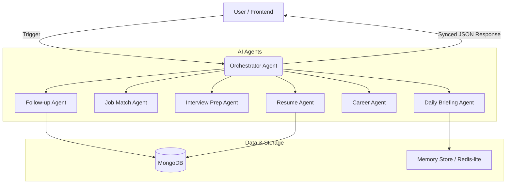
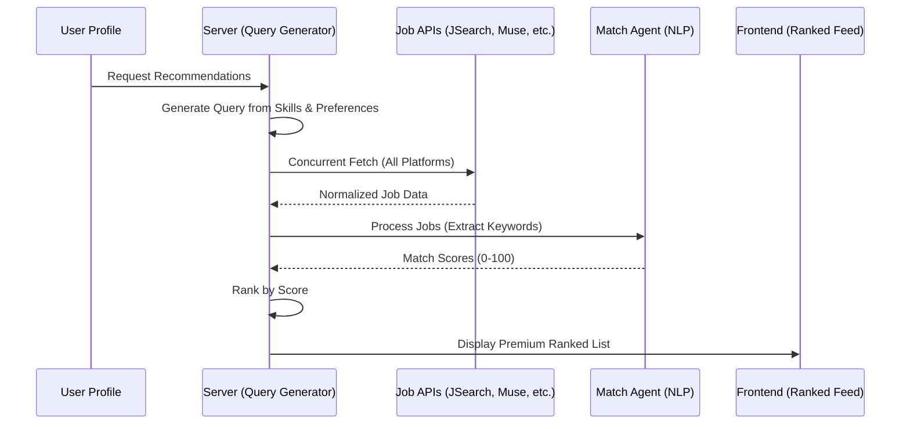
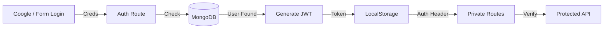

# Apply-Flow: AI-Powered Career Assistant 🚀

Apply-Flow is a premium, full-stack job search and discovery platform that transforms the job hunt from a chore into a personalized, AI-guided journey. Using a **Multi-Agent Orchestration** system, it not only aggregates jobs but acts as your personal "Career Butler."

---

## 🏗️ System Architectures

### 1. Multi-Agent AI Orchestration
The heart of Apply-Flow is its **Orchestration Layer**. Instead of a single AI prompt, we use specialized agents to handle specific domains of the career search.



### 2. Job Recommendation Flow
Our "Discover" system doesn't just pull from one API; it aggregates and scores in real-time.



### 3. Authentication & Security Flow
We use a hybrid approach with JWT for local sessions and OAuth 2.0 for quick onboarding.



---

## 📱 Page-by-Page Deep Dive

### 1. Butler Dashboard (`/dashboard`)
The "Daily Overview" for the job seeker.
- **Morning Briefing**: AI analyzes your upcoming tasks and matches, generating an upbeat message and high-priority pills.
- **Live Tracker Stats**: Direct sync with your application database showing progress across statuses.
- **Action Items**: A list of applications that need follow-ups (based on the `followUpAgent` logic).
- **Actions**: "Generate Briefing" (manual override), "Refresh Stats", "Quick Start Onboarding".

### 2. Job Discovery (`/discover`)
The intelligence engine for finding new roles.
- **Multi-API Aggregation**: Jobs are fetched concurrently from JSearch, Adzuna, and The Muse.
- **Matching Score**: Each job is analyzed against your skills stored in your profile.
- **Actions**: "View & Apply" (External Redirect), "Search by Keyword" (Custom exploration).

### 3. Application Tracker (`/applications`)
Your personal CRM for job hunting.
- **CRUD Operations**: Add, Edit, and Delete job applications.
- **Status Pipeline**: Shift jobs from "Applied" to "Interview", "Offer", or "Rejected".
- **Notes & Logs**: Keep track of specific details for each role.
- **Actions**: "Add Job" (Modal), "Update Status", "Filter by Status".

### 4. Career Butler (`/career`)
Self-improvement through data analysis.
- **Pattern Recognition**: Analyzes your last 3 rejections to find skill gaps.
- **Personalized Roadmap**: Generates a step-by-step plan to improve your "fit" for your dream roles.
- **Resume Analysis**: Upload your PDF resume to have it scanned against market requirements.

### 5. Job Detail View (`/jobs/:id`)
The deep-dive for a specific application.
- **Interviewer Prep Kit**: If you mark a job as "Interview", the agent generates a custom prep kit.
- **AI Email Drafts**: Generate professional follow-up emails based on the time since your application.
- **Actions**: "Generate Prep Kit", "Draft Follow-up Email".

---

## ✨ AI Features & Logic

- **Daily Briefing Agent**: Uses **Groq (Llama 3.3)** to synthesize user data into a concise, encouraging brief. Features "Live Sync" to ensure counts are always accurate.
- **Follow-up Agent**: Logic: `(Applied Date < Today - 1 Day) & (Status == 'Applied')` -> Trigger Follow-up Action.
- **Job Match Agent**: Uses NLP keyword extraction to score jobs based on the user's Profile Skills and Preferred Roles.
- **Resume Agent**: Parses PDF text to extract skills and match them against target job descriptions.

---

## 🛠️ Tech Stack & Dependencies

- **Main Framework**: React 18 (Vite) & Express 5.
- **AI Integration**: AI SDK with Groq Provider.
- **Data Layer**: MongoDB Atlas with Mongoose.
- **Automation**: node-cron (Scheduler).
- **Styling**: Vanilla CSS with a Neo-Brutalism design system.

---

## 📦 Installation & Setup

### 1. Local Development
```bash
git clone https://github.com/Sukesh-2006-cse/Job_Assistent.git
cd Job_Assistent
npm install
cd server && npm install
```

### 2. Environment Configuration (`server/.env`)
```env
MONGODB_URI=your_mongodb_uri
PORT=5000
JWT_SECRET=your_jwt_secret
GROQ_API_KEY=your_groq_key
JSEARCH_KEY=your_key
ADZUNA_ID=your_id
ADZUNA_KEY=your_key
MUSE_KEY=your_key
```

### 3. Run Commands
```bash
# Root: Start both Client & Server
npm run start:all
```

---

## 🛡️ Robustness & Performance
- **Zero-Cache Sync**: Backend uses `res.setHeader('Cache-Control', 'no-store')` on dashboard routes to ensure real-time accuracy after adding jobs.
- **Safe Agent Execution**: All AI agents are wrapped in `safeRun` logic to prevent partial failures from crashing the UI.
- **Defensive Frontend**: React components use optional chaining and fallback states to withstand intermittent API errors.

## 📄 License
MIT License. Built with passion for the modern job seeker.
