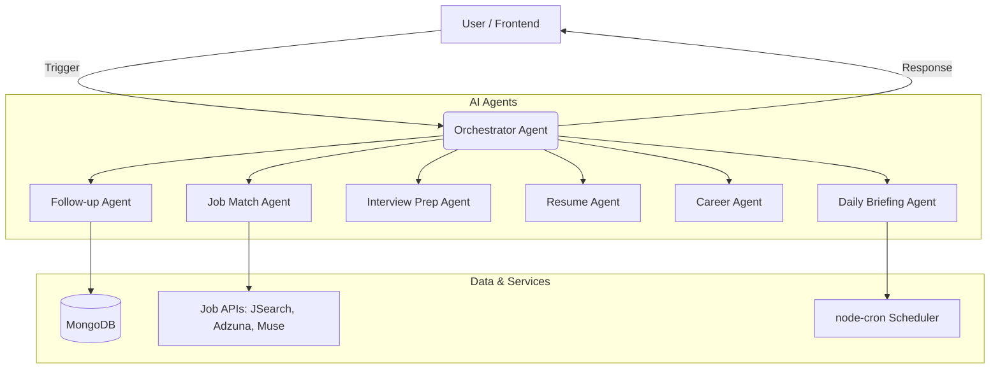

# Apply-Flow: AI-Powered Career Assistant 🚀

Apply-Flow is a premium, full-stack job search and discovery platform that transforms the job hunt from a chore into a personalized, AI-guided journey. Using a **Multi-Agent Orchestration** system, it not only aggregates jobs but acts as your personal "Career Butler."


## 🏗️ System Architecture

The core of Apply-Flow is its **Intelligent Multi-Agent System**. It uses a central **Orchestrator** to coordinate specialized agents powered by **Groq (Llama 3.3 70B)**.



---

## ✨ Key Features

### 1. 🌅 Daily Career Briefing
Wake up to a personalized morning message. Our **Daily Briefing Agent** runs every morning at 9:00 AM to analyze your applications and interviews, providing an encouraging summary and clear "next steps."

### 2. 🕴️ The Butler Dashboard
A Neo-Brutalism inspired control center that highlights:
- **Actions for Today**: AI-prioritized follow-ups for your applications.
- **Live Stats**: Real-time tracking of Total, Applied, Interviews, and Offers.
- **AI Sync**: Every change in your tracker is immediately reflected in your daily metrics.

### 3. 🎯 Smart Job Discovery
Don't just search; discover. Apply-Flow aggregates listings from **JSearch, Adzuna, and The Muse**, then uses NLP to score them against your unique profile skills and preferences.

### 4. 📈 Career Roadmap & Insights
After 3 rejections, the **Career Agent** automatically analyzes patterns in your feedback and job descriptions to provide a tailored roadmap for skill improvement.

### 5. 📧 AI Follow-up Generation
Struggling with what to say? The **Follow-up Agent** drafts professional, personalized emails for your specific applications, ready to copy and send.

### 6. 📄 Resume Analysis
Upload your resume (PDF) and let the **Resume Agent** extract skills and match them against job requirements to identify gaps before you apply.

---

## 🛠️ Tech Stack

- **Frontend**: React 18, Vite, Neo-Brutalism CSS, React Router 6.
- **Backend**: Node.js, Express 5.
- **AI/ML**: Groq API (Llama 3.3 70B), AI SDK.
- **Database**: MongoDB Atlas (Mongoose).
- **Authentication**: JWT, Google OAuth 2.0, Bcrypt.js.
- **Automation**: node-cron.

---

## 📦 Getting Started

### Prerequisites
- Node.js (v18+)
- MongoDB Atlas Account
- **Groq API Key** (Required for AI features)
- RapidAPI Key (for JSearch)

### Installation

1. **Clone & Install**:
   ```bash
   git clone https://github.com/Sukesh-2006-cse/Job_Assistent.git
   cd Job_Assistent
   npm install
   cd server && npm install
   ```

2. **Environment Configuration**:
   Create `server/.env`:
   ```env
   MONGODB_URI=your_mongodb_uri
   PORT=5000
   JWT_SECRET=your_jwt_secret
   GROQ_API_KEY=your_groq_key
   JSEARCH_KEY=your_rapidapi_key
   ADZUNA_ID=your_id
   ADZUNA_KEY=your_key
   MUSE_KEY=your_key
   ```

3. **Launch**:
   ```bash
   # From root
   npm run start:all
   ```

---

## 🛡️ Security & Performance
- **Zero-Cache Dashboard**: Critical stats use `no-store` headers to ensure data is always fresh.
- **Robust Error Handling**: Agents fail gracefully with defensive programming in the frontend.
- **Secure Storage**: Passwords never touch the DB as plain text; JWTs manage session security.

## 📄 License
MIT License. Built for the modern job seeker.
